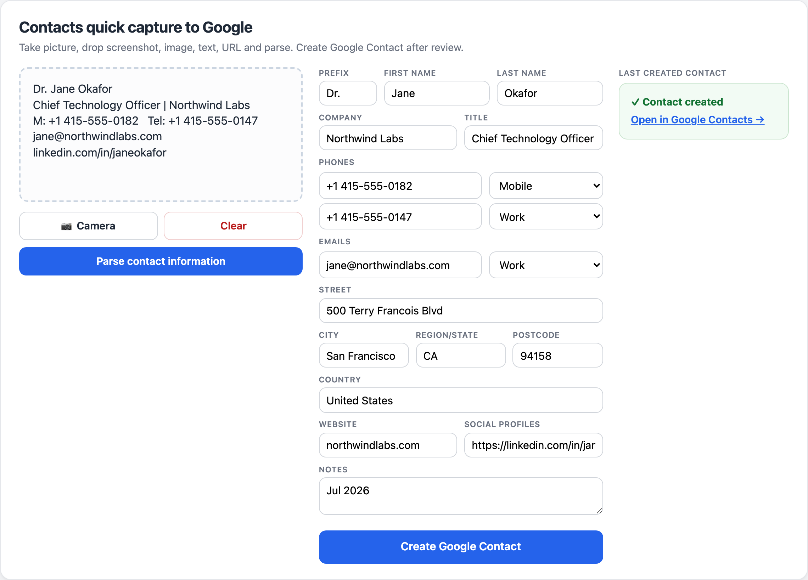

# Contacts quick capture to Google

Turn any messy contact detail — a business-card photo, an email signature, a
screenshot, or a URL — into a clean, correctly-labelled **Google Contact** in about
15 seconds. You drop it in, Claude structures it, you glance and confirm, and it's
saved to your Google account.

It runs entirely on your own machine as a small local web page. The only thing that
ever leaves your computer is the single parsing call to Claude and the "create
contact" call to Google.



---

## The problem it solves

Contacts arrive in formats Google Contacts can't ingest: a photo of a business card,
a signature block at the bottom of an email, a "who's who" screenshot, a conference
badge. Typing them in by hand is slow and error-prone — and people rarely bother, so
the contact is lost.

This tool removes the typing. **Capture → Parse → Review → Create.** Claude reads the
raw input and returns structured fields (name, company, phones, emails, address,
socials) already mapped to Google's own labels (Mobile, Work, Work Fax, Profile, …).
You keep full control: nothing is saved until you review the fields and click create.

---

## How it works

```
  Capture              Parse                 Review              Create
 ┌─────────┐        ┌──────────┐         ┌────────────┐       ┌──────────────┐
 │ text /  │  ───▶  │  Claude  │  ───▶   │ editable   │  ───▶ │ Google       │
 │ image / │        │ (returns │         │ contact    │       │ People API   │
 │ camera /│        │  JSON)   │         │ fields     │       │ createContact│
 │ URL     │        └──────────┘         └────────────┘       └──────────────┘
 └─────────┘        local machine ────────────────────────▶   your Google account
```

- **Parsing** is done by **Claude** — by default through the Claude Code CLI on your
  Claude subscription (no API key, no per-contact cost); optionally through the
  Anthropic API with a key.
- **Saving** uses the **Google People API** `createContact`, writing to whichever
  Google account you authorize once.
- Everything else — the web page, your review, the image handling — runs locally on
  `localhost`.

---

## What it captures

Fields Claude extracts, and the Google Contacts label each maps to:

| Field | Notes |
|---|---|
| Prefix | e.g. *Dr.*, *Prof.* → Google's name-prefix field (not stuffed into the name) |
| First / Last name | |
| Company / Title | |
| Phones | each numbered line gets a Google label: **Mobile**, **Work**, **Work fax**, **Home**, **Main**, … |
| Emails | labelled, defaulting to **Work** |
| Address | street, city, region/state, postcode, country |
| Website | stored as a URL labelled **Home page** |
| Social profiles | LinkedIn / X / GitHub / … stored as URLs labelled **Profile** (Google has no dedicated social field) |
| Notes | auto-prefixed with the capture month + year (e.g. `Jul 2026`) as the first line, so you always know when you saved a contact |

The **Create Google Contact** button stays disabled until you've parsed *and* there's
at least one real field of data, so you can't accidentally save an empty contact.

---

## Requirements & dependencies

| What | Why | Notes |
|---|---|---|
| **Python 3.10+** | runs the local server | 3.9 works but Google libraries warn it's end-of-life |
| **A Google account** | where contacts are saved | a **Google Workspace** account is strongly recommended (see setup) |
| **A parsing engine** | reads the input | either the **Claude Code CLI** signed in to a Claude plan (default), **or** an **Anthropic API key** |
| **Python packages** | `flask`, `requests`, `google-auth-oauthlib`, `google-api-python-client` | installed via `requirements.txt` |
| A modern browser | the UI + camera | camera capture uses the browser's webcam over `localhost` |

> **Platform:** the browser app runs anywhere Python and a browser run. The shell
> commands below assume macOS/Linux (keyboard shortcuts shown are macOS).

---

## Setup (one-time, ~15 min)

### 1. Get the code and install dependencies

```bash
git clone https://github.com/rdtsm/contacts-quick-capture.git
cd contacts-quick-capture
python3 -m venv .venv          # recommended: isolate dependencies
./.venv/bin/pip install -r requirements.txt
```

### 2. Choose the parsing engine

**Option A — Claude subscription (default, no API key, no per-contact cost).**
Install [Claude Code](https://claude.com/claude-code) and sign in to your Claude plan
(`claude` must be on your `PATH`). That's it — the app calls it automatically.

**Option B — Anthropic API (metered, ~0.1 US-cent per contact).**
Get a key from [console.anthropic.com](https://console.anthropic.com), then:

```bash
export ANTHROPIC_API_KEY=sk-ant-...   # add to ~/.zshrc so it persists
```

If the key is set, the app uses the API; otherwise it uses the Claude Code CLI.

### 3. Create Google OAuth credentials (~10 min)

Do this on a **Google Workspace** account so the OAuth app can be **Internal** —
which means no token expiry, no Google verification, and no "unverified app" warning,
ever. (A personal Gmail account also works but needs extra steps — see
[Using a personal Gmail account](#using-a-personal-gmail-account).)

1. Go to [console.cloud.google.com](https://console.cloud.google.com/) signed in as
   **your Google Workspace account** (a Workspace account is what unlocks *Internal*).
2. **Create a project** (e.g. `contact-capture`).
3. **APIs & Services → Library →** enable the **People API**.
4. **OAuth consent screen → User type: Internal →** fill in an app name and your email.
   (Internal ⇒ no test users, no publishing, no verification.)
5. **Credentials → Create credentials → OAuth client ID → Desktop app →** download the
   JSON and save it as **`credentials.json`** in this folder.
6. *Only if a Workspace policy blocks it:* **Admin console → Security → API controls →**
   allow the app (you're the domain admin). Usually not needed.

### 4. Run it

```bash
./.venv/bin/python app.py
```

Open **http://localhost:8321** and pin the browser tab. On your **first** "Create
Google Contact", a browser window asks you to authorize — approve once (no warning,
because it's an Internal app). The authorization is cached in `token.json` and every
future contact is silent.

---

## Daily use

Per contact (~15 s):

1. **Capture** into the drop box — paste text (⌘V), paste/drop a screenshot or image,
   click **📷 Camera** to photograph a card, or paste a URL.
2. **Parse contact information** — Claude fills the fields.
3. **Review** — correct anything; adjust phone/email labels via the dropdowns.
4. **Create Google Contact** — a success message with a link to the new contact
   appears, and the form clears for the next one. **Clear** resets it manually.

| Event | What happens |
|---|---|
| Browser/tab closed | Nothing lost — reopen `localhost:8321` |
| Mac sleep/wake | Server keeps running |
| Mac restart / logout | Server stops — rerun `python app.py` (see [Roadmap](#roadmap) for auto-start) |
| Google token | Auto-refreshes; persists indefinitely for an Internal Workspace app |

---

## Maintenance

- **Update to the latest version:** `git pull`, then restart the server.
- **Restart the server:** rerun `./.venv/bin/python app.py`. The dev server stops on
  logout/restart; re-running is the only step.
- **Change the parsing model / cost:** edit `CLI_MODEL` (subscription path, default
  `sonnet`) or `CLAUDE_MODEL` (API path, default `claude-haiku-4-5`) near the top of
  `app.py`.
- **Switch Google account:** delete `token.json`, restart, and authorize with the
  other account. (See below for a personal Gmail account.)
- **Revoke the app's access at any time:**
  [myaccount.google.com/permissions](https://myaccount.google.com/permissions), or your
  Workspace Admin console.

### Using a personal Gmail account

A consumer Gmail account can't make an *Internal* app, so create the OAuth client as an
**External** app: add yourself as a **test user**, and **publish the app to production**
to avoid Google expiring the token every 7 days. Save the client as `credentials.json`
as above. No code change is needed.

---

## Privacy & security

- **Local only.** The server binds to `127.0.0.1:8321` and is not reachable from your
  network. The web page, image handling, and review all happen on your machine.
- **What leaves your machine:** exactly two calls — the contact text/image to **Claude**
  for parsing, and the final `createContact` to **Google**. Nothing else is uploaded or
  stored remotely.
- **Cross-site protection.** POST endpoints reject requests whose `Origin` isn't the
  app's own page, so a random website can't drive your local server.
- **`credentials.json`** (your OAuth client secret) and **`token.json`** (your saved
  Google authorization) are both git-ignored and never committed. `token.json` is
  written owner-only (`chmod 600`) — treat it as a password.
- **Scope.** The app requests the `contacts` scope (full read/write — Google offers no
  create-only scope), but the code **only ever calls `createContact`**; it never reads
  or modifies existing contacts. Revoke access anytime via the link above.

---

## Limitations

- **Login-walled URLs** (LinkedIn profiles, etc.) can't be fetched server-side —
  screenshot the page and drop the image instead.
- **Pasted URLs are fetched as-is.** The server requests whatever URL you paste, with
  your machine's network access — only paste URLs you trust. (Download is capped at
  500 KB.)
- **One image per capture** — pasting or capturing a second image replaces the first.
- **No duplicate detection** — Google Contacts' built-in "Merge & fix" handles dupes.
- Extra phone/email rows beyond what Claude finds aren't added in the UI — add or edit
  them in Google Contacts afterward.
- **Basic accessibility** — form labels aren't wired to inputs for screen readers.
- Parsing quality depends on the input's legibility (a sharp, well-framed card photo
  parses best).

---

## Roadmap

- **Auto-start at login** — a macOS LaunchAgent so `localhost:8321` is always live and
  you never restart the server manually.
- **Duplicate detection** — look up existing contacts by email/phone before creating and
  offer to update instead.
- **Lower-friction capture** — a macOS Share/Quick Action or menu-bar shortcut that
  sends the clipboard/selection straight to parsing, skipping the browser tab.

---

## License

[MIT](LICENSE) © Rainer Deutschmann
